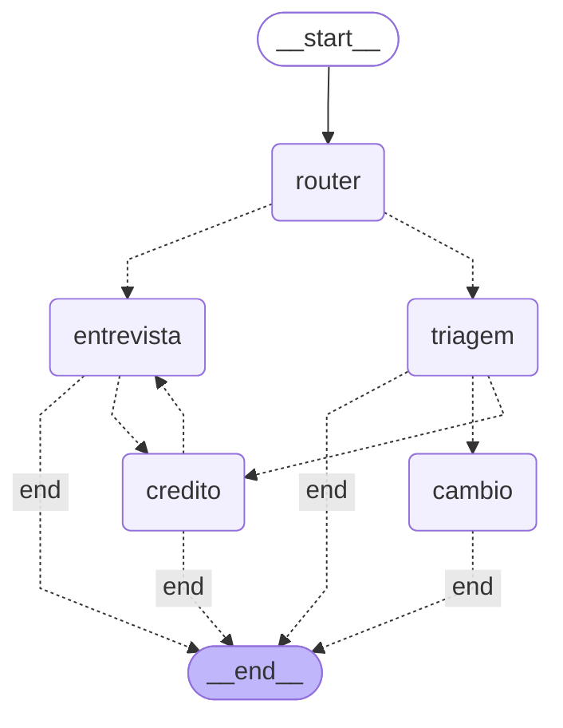

# Banco Ágil - Sistema Multi-Agente Inteligente

Sistema de atendimento bancário automatizado utilizando arquitetura multi-agente baseada em LangGraph e LLMs, desenvolvido para gerenciar processos de autenticação, crédito, câmbio e entrevistas de forma conversacional e inteligente.

---

## Visão Geral do Projeto

O **Banco Ágil** é uma solução completa de atendimento bancário que utiliza múltiplos agentes especializados coordenados por um grafo de estados para fornecer uma experiência conversacional natural e eficiente. O sistema integra validação de dados, consultas de informações financeiras e processos de tomada de decisão automatizados.

### Principais Características

- **Arquitetura Multi-Agente**: 4 agentes especializados que trabalham de forma coordenada
- **Fluxo Conversacional Natural**: Interação em linguagem natural utilizando GPT-4
- **Gestão de Estado Persistente**: Mantém contexto completo da conversa através do LangGraph
- **Autenticação Segura**: Sistema de validação com controle de tentativas
- **Processamento Inteligente de Crédito**: Análise automatizada baseada em score
- **Interface Web Interativa**: Interface Streamlit moderna e responsiva
- **Cobertura de Testes**: testes automatizados com pytest

---

## Tutorial de Execução e Testes

### Pré-requisitos

- Python 3.11 ou superior
- pip (gerenciador de pacotes Python)
- Git (opcional, para clonar repositório)
- Chave de API da OpenAI
- Docker e Docker Compose (para execução em container)

### Instalação Local

#### 1. Clone o repositório
```bash
git clone <url-do-repositorio>
cd banco-agil-desafio
```

#### 2. Crie um ambiente virtual
```bash
# Linux/Mac
python3 -m venv venv
source venv/bin/activate

# Windows
python -m venv venv
venv\Scripts\activate
```

#### 3. Instale as dependências
```bash
pip install -r requirements.txt
```

#### 4. Configure as variáveis de ambiente
Crie um arquivo `.env` na raiz do projeto:
```bash
OPENAI_API_KEY=sk-...sua-chave-aqui...
```

### Executando a Aplicação

#### Opção 1: Interface Streamlit (Local)
```bash
streamlit run app_streamlit.py
```
Acesse: http://localhost:8501

#### Opção 2: Docker
```bash
# Inicie o container
docker-compose up -d

# Verifique os logs
docker-compose logs -f banco-agil

# Acesse: http://localhost:8501

# Parar o container
docker-compose down
```

#### Opção 3: LangGraph Studio (Desenvolvimento)
```bash
langgraph dev
```
Acesse: http://localhost:8123

### Executando Testes

#### Todos os testes
```bash
pytest -v
```

#### Executar testes no Docker
```bash
docker-compose exec banco-agil pytest -v
```
---

## Arquitetura do Sistema

### Diagrama do Grafo de Fluxo



### Componentes Principais

#### 1. **Router (Roteador)**
- **Função**: Ponto de entrada do sistema que direciona para o agente apropriado
- **Responsabilidades**:
  - Verifica se há processo de entrevista ativa
  - Direciona novos usuários para triagem
  - Mantém usuários em entrevista no fluxo correto

#### 2. **Agente de Triagem** ([src/agents/triagem.py](src/agents/triagem.py))
- **Função**: Autenticação e direcionamento de clientes
- **Responsabilidades**:
  - Coleta e valida CPF (11 dígitos)
  - Valida data de nascimento (formato AAAA-MM-DD)
  - Controla tentativas de autenticação (máximo 3)
  - Identifica intenção do cliente através de NLU
  - Redireciona para agente especializado (crédito ou câmbio)
- **Ferramentas**: `autenticar_cliente`, `encerrar_atendimento`
- **Fluxos de Saída**: `credito`, `cambio`, `end`

#### 3. **Agente de Crédito** ([src/agents/credito.py](src/agents/credito.py))
- **Função**: Gestão de limite de crédito
- **Responsabilidades**:
  - Consulta limite atual do cliente
  - Processa solicitações de aumento de limite
  - Avalia pedidos baseado em score e regras de negócio
  - Oferece entrevista em caso de rejeição
- **Regras de Negócio**:
  - Score 0-299: Limite máximo R$ 1.000
  - Score 300-599: Limite máximo R$ 5.000
  - Score 600-799: Limite máximo R$ 15.000
  - Score 800-1000: Limite máximo R$ 50.000
- **Ferramentas**: `consultar_limite_credito`, `solicitar_aumento_limite`, `encerrar_atendimento`
- **Fluxos de Saída**: `entrevista`, `end`

#### 4. **Agente de Entrevista** ([src/agents/entrevista.py](src/agents/entrevista.py))
- **Função**: Coleta de dados socioeconômicos para recálculo de score
- **Responsabilidades**:
  - Conduz entrevista conversacional natural
  - Coleta 5 informações essenciais:
    - Renda mensal (em reais)
    - Tipo de emprego (formal/autonomo/desempregado)
    - Despesas fixas mensais (em reais)
    - Número de dependentes (0-3+)
    - Existência de dívidas ativas (sim/não)
  - Processa linguagem natural (ex: "5 mil" = 5000)
  - Recalcula score baseado em algoritmo ponderado
- **Ferramentas**: `calcular_novo_score`, `encerrar_atendimento`
- **Fluxos de Saída**: `credito`, `end`

#### 5. **Agente de Câmbio** ([src/agents/cambio.py](src/agents/cambio.py))
- **Função**: Consulta de cotações de moedas
- **Responsabilidades**:
  - Identifica moeda solicitada (USD, EUR, GBP, etc.)
  - Consulta cotação em tempo real
  - Apresenta informações de compra e venda
  - Permite consultas múltiplas
- **Ferramentas**: `consultar_cotacao_moeda`, `encerrar_atendimento`
- **Fluxos de Saída**: `end`

### Manipulação de Dados

#### Estado Compartilhado (AgentState)
O sistema utiliza um estado centralizado definido em [src/core/state.py](src/core/state.py) que persiste através de todos os agentes:

```python
{
    "messages": List[BaseMessage],          # Histórico de mensagens
    "current_agent": str,                   # Agente ativo
    "authenticated": bool,                  # Status de autenticação
    "cpf": str,                            # CPF do cliente
    "nome_cliente": str,                    # Nome do cliente
    "limite_credito": float,                # Limite atual
    "score": int,                          # Score de crédito
    "authentication_attempts": int,         # Tentativas de login
    "pending_redirect": str,                # Redirecionamento pendente
    "should_end": bool,                     # Flag de encerramento
    "temp_cpf": str,                       # CPF temporário (pré-auth)
    "temp_data_nascimento": str            # Data temp (pré-auth)
}
```

#### Persistência de Dados
- **Formato**: CSV para simplicidade e portabilidade
- **Localização**: Diretório `data/`
- **Arquivos**:
  - `clientes.csv`: Dados cadastrais e score
  - `score_limite.csv`: Tabela de limites por faixa de score
  - `solicitacoes_aumento_limite.csv`: Histórico de solicitações
- **Gerenciamento**: Classe `Database` em [src/data_models/database.py](src/data_models/database.py)

#### Fluxo de Dados
1. **Entrada**: Mensagem do usuário (HumanMessage)
2. **Processamento**: Router → Agente Especializado → Atualização de Estado
3. **Ferramentas**: Executadas conforme necessidade (ex: autenticação, consultas)
4. **Saída**: Resposta do agente (AIMessage) + Estado atualizado
5. **Redirecionamento**: Conditional edges determinam próximo agente ou fim

---

## Funcionalidades Implementadas

### 1. Autenticação de Clientes
- Validação por CPF (11 dígitos) e data de nascimento (AAAA-MM-DD)
- Extração inteligente de dados da mensagem usando regex
- Sistema de controle de tentativas (máximo 3)
- Bloqueio automático após falhas sucessivas

### 2. Gestão de Crédito
- Consulta de limite atual
- Solicitação de aumento de limite
- Aprovação/rejeição automática baseada em score
- Sistema de escalonamento para entrevista em caso de rejeição

### 3. Entrevista de Crédito
- Coleta conversacional de 5 parâmetros socioeconômicos
- Processamento de linguagem natural para valores numéricos
- Algoritmo de recálculo de score:
  ```
  score = 300 (base) +
          min(renda_mensal / 100, 200) +
          (150 se emprego formal, 100 se autônomo, 0 se desempregado) +
          max(-despesas_fixas / 50, -150) +
          (-50 * num_dependentes) +
          (-100 se tem_dividas else 0)
  ```
- Atualização automática do score no banco de dados

### 4. Consulta de Câmbio
- Suporte a múltiplas moedas (USD, EUR, GBP, JPY, etc.)
- Integração com API de câmbio real
- Apresentação de cotações de compra e venda
- Permite consultas sequenciais

### 5. Interface Conversacional
- Chat em linguagem natural via Streamlit
- Barra lateral com informações do cliente
- Exibição dinâmica de limite e score
- Botão de "Nova Conversa" para reset de sessão

### 6. Controle de Fluxo
- Redirecionamento inteligente entre agentes
- Detecção de intenção do usuário (NLU)
- Sistema de flags para controle de estado
- Encerramento gracioso de atendimento

---

## Desafios Enfrentados e Soluções

### 1. Coordenação entre Agentes
**Desafio**: Garantir que múltiplos agentes compartilhem estado de forma consistente sem duplicação ou perda de dados.

**Solução**: Implementação de um estado centralizado (`AgentState`) usando TypedDict do LangGraph, com sistema de `pending_redirect` para controlar transições entre agentes. Cada nó atualiza apenas seus campos específicos e preserva os demais através de merge de dicionários.

### 2. Autenticação em Múltiplas Etapas
**Desafio**: Coletar CPF e data de nascimento de forma natural sem forçar formato rígido, enquanto mantém controle de tentativas.

**Solução**: Sistema de estado temporário (`temp_cpf`, `temp_data_nascimento`) que persiste dados parciais. Regex para extração automática de padrões (11 dígitos para CPF, AAAA-MM-DD para data). Contador de tentativas com reset após sucesso.

### 3. Processamento de Linguagem Natural em Entrevista
**Desafio**: Interpretar valores como "5 mil", "3.5k", "CLT", "autônomo" de forma robusta.

**Solução**: Prompts detalhados no System Message orientando o LLM a normalizar valores. Exemplos explícitos de conversões no prompt (ex: "5 mil = 5000"). Validação dos argumentos antes de invocar ferramentas.

### 4. Prevenção de Loops Infinitos
**Desafio**: Evitar ciclos entre agentes (ex: credito → entrevista → credito → entrevista...).

**Solução**: Regras claras de redirecionamento nos conditional edges. Flag `pending_redirect` que é consumida e limpa após cada transição. Condições de saída definidas em cada agente.

### 5. Sincronização de Estado com Interface
**Desafio**: Manter UI do Streamlit sincronizada com estado interno do grafo LangGraph.

**Solução**: Sistema de detecção de mudanças de estado (`state_changed`) que aciona `st.rerun()` automaticamente. Session state do Streamlit armazena cópia do `agent_state` que é atualizado após cada invoke do grafo.

---

## Escolhas Técnicas e Justificativas

### Stack Principal

#### **LangGraph** (Orquestração de Agentes)
**Por quê?**
- Suporta nativamente grafos de estado cíclicos (essencial para fluxos como credito ↔ entrevista)
- Conditional edges permitem lógica de roteamento complexa sem código imperativo
- Integração nativa com LangChain para gerenciamento de LLMs
- Permite debugging visual através do LangSmith
- StateGraph garante persistência automática de estado entre nós

**Como facilita?**
- Cada agente é um nó isolado, facilitando manutenção e testes
- Adição de novos agentes requer apenas criar nó e definir edges
- Estado compartilhado elimina necessidade de gerenciamento manual de contexto

#### **LangChain** (Interface com LLMs)
**Por quê?**
- Abstração de alto nível para diferentes providers de LLM
- Sistema de mensagens (HumanMessage, AIMessage, SystemMessage) padroniza comunicação
- Tool binding facilita integração de ferramentas customizadas
- Chain of thought e prompts estruturados melhoram qualidade das respostas

**Como se encaixa?**
- `llm_with_tools` permite que agentes chamem funções Python de forma declarativa
- System prompts definem personalidade e regras de cada agente
- Histórico de mensagens mantém contexto conversacional

#### **OpenAI GPT-4** (Modelo de Linguagem)
**Por quê?**
- Melhor desempenho em NLU para português brasileiro
- Capacidade de tool calling confiável e determinística
- Compreensão de contexto conversacional multi-turno
- Raciocínio complexo para decidir entre ferramentas

**Como se encaixa?**
- Cada agente usa instância separada com prompts especializados
- Tool definitions são automaticamente convertidas para schema OpenAI
- Responses incluem tanto texto quanto tool calls estruturados

#### **Streamlit** (Interface Web)
**Por quê?**
- Desenvolvimento rápido de interfaces sem frontend complexo
- Session state nativo para gerenciar estado da aplicação
- Componentes de chat prontos (`st.chat_message`, `st.chat_input`)
- Deploy simples (Streamlit Cloud, Docker)

**Como se encaixa?**
- Session state armazena grafo LangGraph e estado do agente
- Cada mensagem do usuário invoca o grafo e atualiza UI
- Sidebar exibe informações de autenticação em tempo real

#### **CSV + Dataclasses** (Persistência)
**Por quê?**
- Simplicidade adequada ao escopo do projeto
- Facilita inspeção manual de dados
- Portabilidade sem dependências de banco de dados
- Performance suficiente para volume esperado

**Como se encaixa?**
- Classe `Database` abstrai leitura/escrita de CSVs
- Dataclasses (`Cliente`, `SolicitacaoAumento`, `ScoreLimite`) tipam dados
- Pandas facilita operações de busca e atualização

---

## Configuração e Uso do LangSmith

### O que é LangSmith?

LangSmith é uma plataforma de observabilidade e debugging para aplicações LangChain/LangGraph, permitindo:
- Rastreamento detalhado de execuções
- Visualização de fluxo entre agentes
- Análise de custos de API
- Debugging de prompts e respostas
- Monitoramento de performance

### Tutorial de Configuração

#### 1. Criar Conta no LangSmith

1. Acesse: https://smith.langchain.com/
2. Clique em "Sign Up"
3. Crie conta com email ou GitHub
4. Confirme email e faça login

#### 2. Obter API Key

1. Crie um novo projeto de rastremento
2. Copie os valores das variáveis de ambiente disponibilizadas

#### 3. Configurar Variáveis de Ambiente

Adicione ao seu arquivo `.env`:

```bash
# OpenAI
OPENAI_API_KEY=sk-...

# LangSmith
LANGCHAIN_TRACING_V2=true
LANGCHAIN_ENDPOINT=https://api.smith.langchain.com
LANGCHAIN_API_KEY=ls__...
LANGCHAIN_PROJECT=banco-agil
```

**Explicação das variáveis:**
- `LANGCHAIN_TRACING_V2=true`: Ativa rastreamento
- `LANGCHAIN_ENDPOINT`: URL da API do LangSmith
- `LANGCHAIN_API_KEY`: Sua chave de API
- `LANGCHAIN_PROJECT`: Nome do projeto (organiza traces)

#### 4. Executar Aplicação com Rastreamento

```bash
# Certifique-se de que o .env está configurado
streamlit run app_streamlit.py
```

Todas as execuções serão automaticamente enviadas ao LangSmith.

### Usando o LangSmith

#### Visualizar Traces

1. Acesse: https://smith.langchain.com/
2. No menu lateral, clique em "Tracing"
3. Selecione o projeto que você criou
4. Você verá lista de todas as execuções (runs)

---

## Estrutura do Projeto

```
banco-agil-desafio/
├── src/                           # Código fonte principal
│   ├── agents/                    # Agentes especializados
│   │   ├── base.py               # Classe base com configuração de LLM
│   │   ├── triagem.py            # Agente de autenticação e triagem
│   │   ├── credito.py            # Agente de gestão de crédito
│   │   ├── entrevista.py         # Agente de entrevista socioeconômica
│   │   └── cambio.py             # Agente de consulta de câmbio
│   ├── tools/                     # Ferramentas (functions) dos agentes
│   │   ├── autenticacao.py       # Ferramenta de autenticação
│   │   ├── credito.py            # Ferramentas de crédito
│   │   ├── cambio.py             # Ferramenta de cotação
│   │   ├── score.py              # Ferramenta de recálculo de score
│   │   └── atendimento.py        # Ferramenta de encerramento
│   ├── core/                      # Núcleo do sistema
│   │   ├── graph.py              # Definição do grafo LangGraph
│   │   └── state.py              # Definição do estado compartilhado
│   ├── data_models/               # Modelos de dados
│   │   ├── models.py             # Dataclasses (Cliente, Solicitacao, etc)
│   │   └── database.py           # Classe de acesso a dados CSV
│   └── config/                    # Configurações
│       └── settings.py           # Carregamento de variáveis de ambiente
├── tests/                         # Suíte de testes
│   ├── unit/                      # Testes unitários
│   │   ├── test_database.py
│   │   ├── test_models.py
│   │   ├── test_tools_autenticacao.py
│   │   ├── test_tools_credito.py
│   │   └── test_tools_cambio.py
│   ├── integration/               # Testes de integração
│   │   ├── test_agents.py        # Testa agentes isoladamente
│   │   └── test_graph.py         # Testa fluxos completos
│   ├── fixtures/                  # Dados de teste reutilizáveis
│   │   ├── clientes.py           # Fixtures de clientes
│   │   └── responses.py          # Fixtures de respostas de API
│   └── conftest.py               # Configuração global de testes
├── data/                          # Dados persistidos
│   ├── clientes.csv              # Base de clientes
│   ├── score_limite.csv          # Tabela score → limite
│   └── solicitacoes_aumento_limite.csv  # Histórico de solicitações
├── app_streamlit.py              # Interface web principal
├── langgraph.json                # Configuração LangGraph CLI
├── requirements.txt              # Dependências Python
├── pytest.ini                    # Configuração pytest
├── Dockerfile                    # Container Docker
├── docker-compose.yml            # Orquestração Docker
├── .env                          # Variáveis de ambiente (não versionado)
├── .gitignore
└── README.md                     # Esta documentação
```

---

## Dados de Teste

Para facilitar testes, o sistema inclui clientes pré-cadastrados em `data/clientes.csv`:

| cpf | nome | data_nascimento | limite_credito | score |
|-----|------|----------------|---------------|-------|
| 12345678901 | João Silva | 1990-05-15 | 5000.00 | 650 |
| 98765432100 | Maria Santos | 1985-08-20 | 1000.00 | 250 |
| 11122233344 | Carlos Souza | 1992-03-10 | 15000.00 | 750 |

### Exemplos de Interação

#### Fluxo de Autenticação e Crédito
```
Usuário: Olá
Sistema: Bem-vindo ao Banco Ágil! Para continuar, informe seu CPF.

Usuário: 12345678901
Sistema: Obrigado! Agora, por favor, informe sua data de nascimento (AAAA-MM-DD).

Usuário: 1990-05-15
Sistema: Autenticação realizada com sucesso! Bem-vindo, João Silva. Como posso ajudá-lo?

Usuário: Qual meu limite?
Sistema: Seu limite atual é de R$ 5.000,00.

Usuário: Quero aumentar para 10000
Sistema: Sua solicitação de aumento para R$ 10.000,00 foi aprovada! Seu novo limite já está ativo.
```

#### Fluxo com Entrevista
```
Usuário: Quero aumentar meu limite para 20000
Sistema: Infelizmente não foi possível aprovar o limite de R$ 20.000,00 no momento (seu score é 650, máximo permitido: R$ 15.000,00). Posso encaminhá-lo para uma entrevista de crédito que pode melhorar seu score. Deseja fazer a entrevista?

Usuário: Sim
Sistema: Ótimo! Para recalcular seu score, preciso de algumas informações. Qual é sua renda mensal?

Usuário: 8000
Sistema: Entendi. Qual é seu tipo de emprego: formal, autônomo ou desempregado?

Usuário: CLT
Sistema: Certo. Quais são suas despesas fixas mensais?

Usuário: 3000
Sistema: Quantos dependentes você possui?

Usuário: 2
Sistema: Por fim, você possui alguma dívida ativa?

Usuário: Não
Sistema: Seu score foi recalculado! Novo score: 720. Vou redirecioná-lo de volta ao atendimento de crédito.

Sistema: Agora que seu score melhorou, posso reanalizar sua solicitação. O que gostaria de fazer?
```

---

## Licença

Este projeto foi desenvolvido como demonstração técnica para o desafio da T4H.